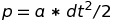
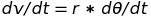
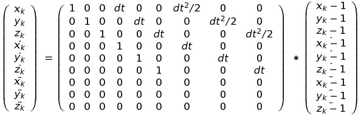
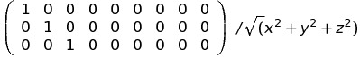

# Practical Course in Robotics

Name: Lei Zhu

# Project Description

The goal of my project is to have the Baxter robot arms mimic my arm motion.  The sensor device used to measure my arm's motion is a normal smart phone with accelerometer and gyroscope.  

Unfortunately, I was not able get my project working.  The main issue is with computing the end positon of my arm with only accelerometer and gyroscope data.

Below, I will first describe the sensor data I received from the smart phone and then describe the approaches I used to calculate the position.

# Sensor Data

## Accelerometer

The accelerometer measures the acceleration with respect to the phone's coordinates as shown in the picture below:

In addition, we also get the phone's angular acceleration data in alpha, beta and gamma.

The accelerometer data is very noisy. 

## Gyroscope

The Gyroscope measures the angle in degree from the initial position.  The initial angles is set when the app is first loaded.  The gyroscope data is very stable.  

## Collecting Data

To make it easy for me to collect data, I am using HTML 5's device orientation and motion events.  Hence, the get sensor data, I just open a web page on my browser.  The data is automatically sent to the web server via the HTTP protocol.  A few things to note:

* The Gyroscope and Accelerometer data are received from different event notifications.  Therefore, it is not possible to have the exact gyroscope measurements when motion events triggers an update of acceleration data.  In this case, I just use the latest gyroscope data.

* Because data is sent using the HTTP protocol via wireless network from my smart phone to my web server, the data received by the web server maybe out of order.  In this case, I simply ignore the older data received more recently.  

# Calculating Position

The initial position at the end of my arm is (0, 1, 0).  I start the app with my arm extended straight directly in front of me while holding my smart phone.  With only accelerometer and gyroscope, it is impossible to find precise position due to the noise in data.  However, there are some characteristics specific to my problem that could help with identifying a precise location:

* Location is bounded to my arm length and motion.
* My motion is not continuous and will stop at some point. I can reset velocity and thus remove some noise.

## Double Integration
Position can be calculated from acceleration by integrating the acceleration with respect to change in time twice.  The formula is:

Where p is position, a is acceleration and dt is change in time

However, due to the noise in acceleration data, the position drifts very quickly and the error makes this method of calculating position virtually useless.

## Angular Velocity
Since the gyroscope data is quiet stable, it gives us the direction of where the phone is pointing to (assuming that our wrist is not flexible).  Therefore, we only need the distance of the phone from the origin (My shoulder) to calculate the position.  Since 

We can get the velocity by integrating the acceleration data once and angular velocity by differenting the gyroscope data once.  By doing so, we avoided double integration and lowers the error from noise. While the data does seem to be cleaner, it still drifts off after a few seconds of motion.  

## Kalman Filter
I implemented a Kalman filter using the gyroscope as the measurement data and the acceleration as the motion data.  The state transition is as follows:

The obervation matrix is:

While the Kalman filter showed a slower drift, unfortunately, it still does not give a stable and precise position.

I already tried to set velocity to 0 when there is no angular velocity.  This does help drift, but the position is still very imprecise.

# Running the program

The server code is written in Python.  The app requires python libraries that can be install by running:
 
``pip install -r requirements.txt``  

To run the app on the server do:

``gunicorn app:app -b 0.0.0.0:5000 -k gevent --worker-connections 1000``

from the project directory.

To start capturing sensor data, open the browser in your smart phone and go to http://{{server}}/

Click on the Capture button to start sending data to the server.

To see the sensor data go to: <http://localhost:5000/plot.html>

To see the position go to: <http://localhost:5000/position.html>

